# 🛒 Retail Sales & Customer Analytics
[](https://purvaja11-retail-sales-analytics.streamlit.app/)

> **Tools:** Python · SQL (SQLite) · Power BI · Excel · Pandas · Plotly  
> **Dataset:** Superstore Sales Dataset (9,994 transactions, 2014–2017)  
> **Business Question:** Which regions, products, and customer segments 
> drive the most profitable growth — and where is the business losing money?

---

## 📊 Power BI Dashboard

### Overview Page
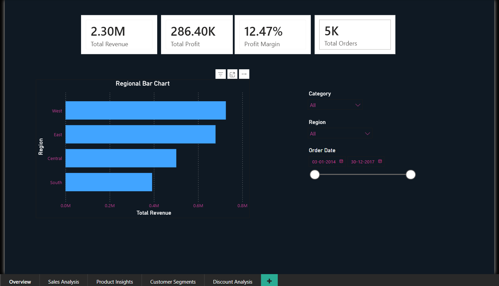

### Sales Analysis
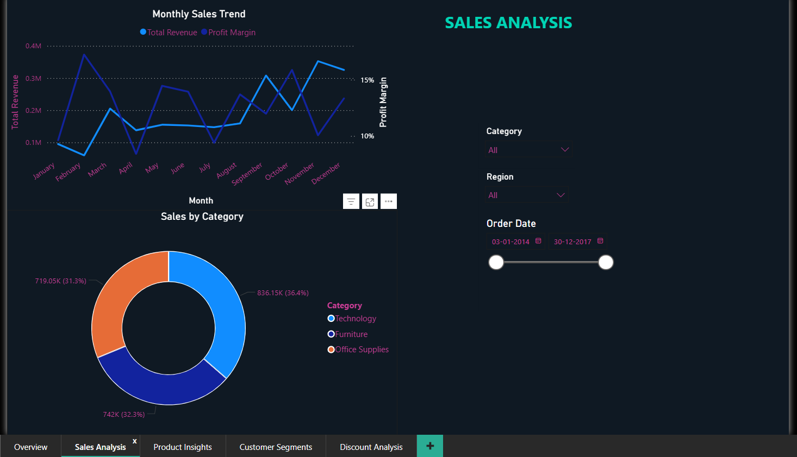

### Product Insights
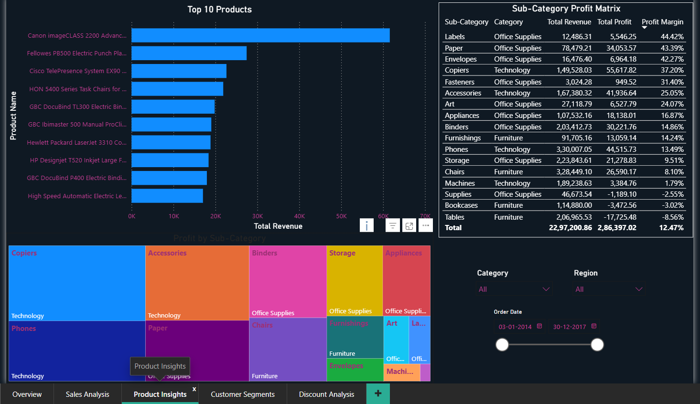

### Customer Segments
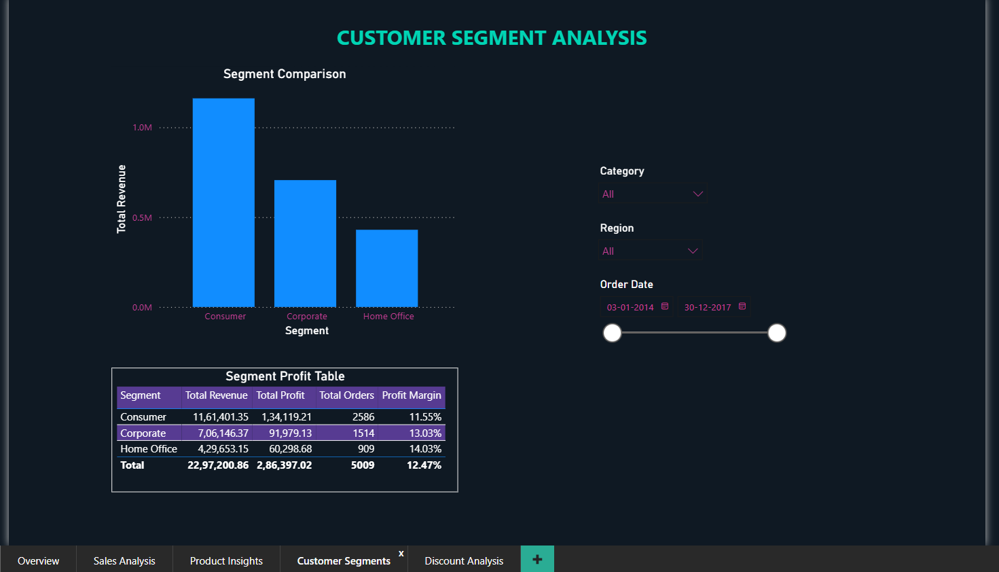

### Discount Analysis Page
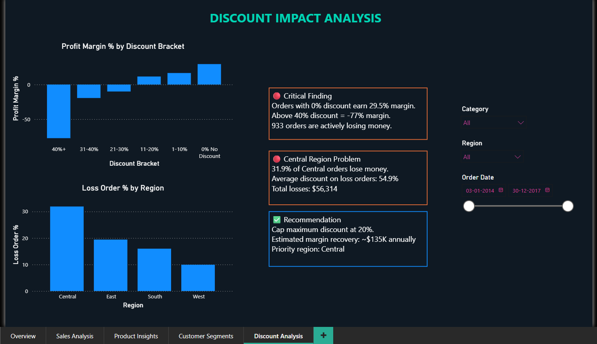

---

## 📊 Excel Analysis

### Regional Performance Pivot
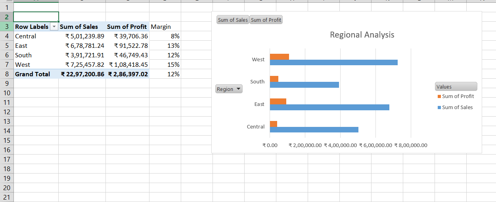

### Category Breakdown Pivot  
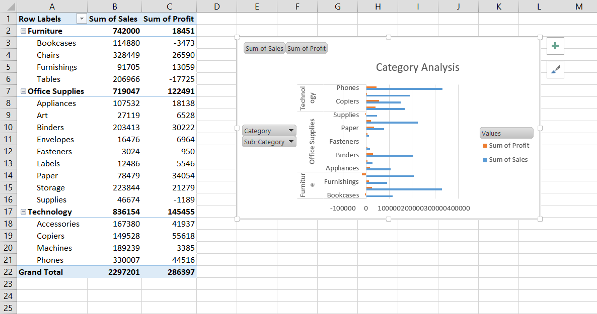

---

## 📈 Python Analysis Charts (Plotly)

### Chart 1 — Regional Sales vs Profit Margin
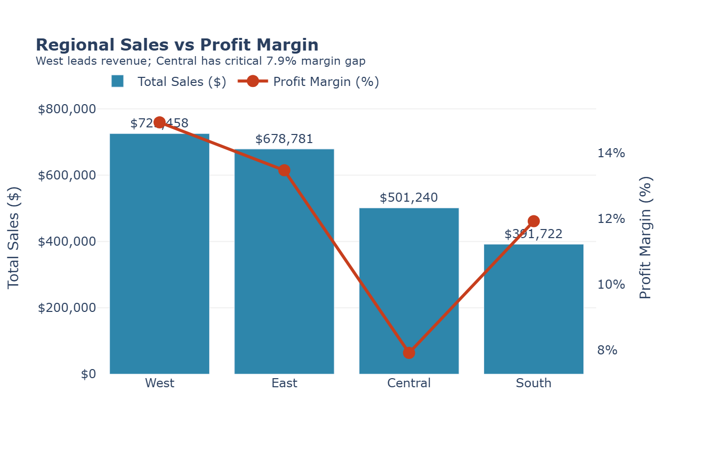

### Chart 2 — Top 10 Products: Sales vs Profit
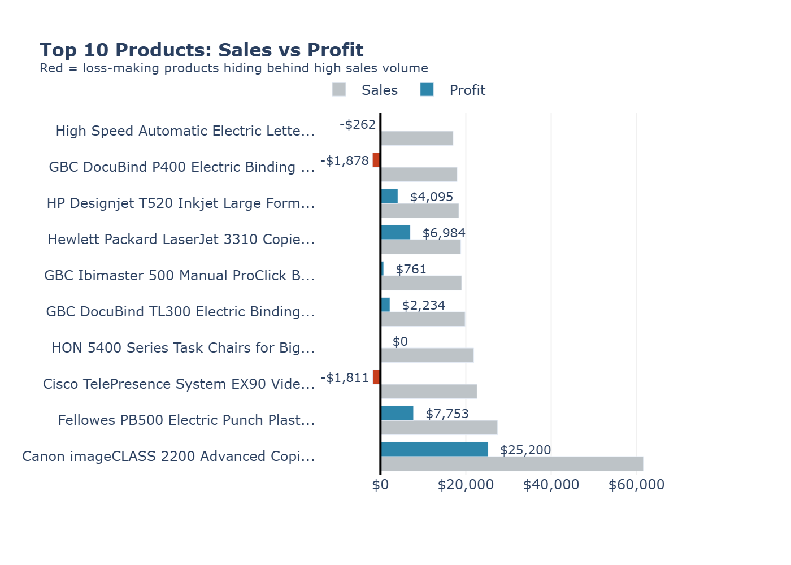

### Chart 3 — Sub-Category Bubble Chart
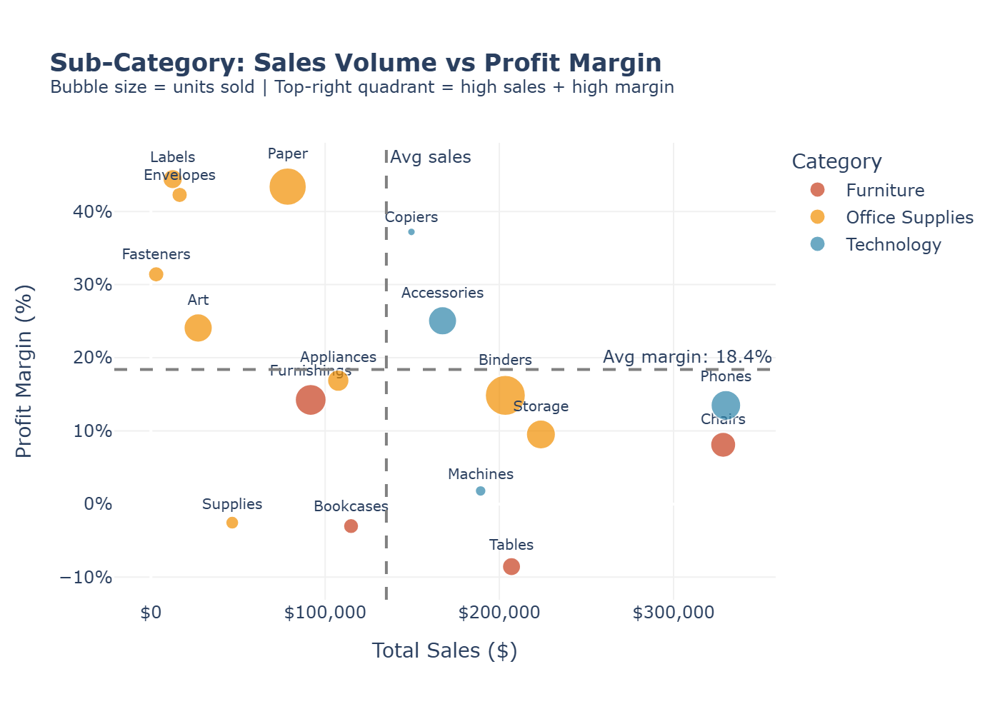

### Chart 4 — Monthly Sales Trend
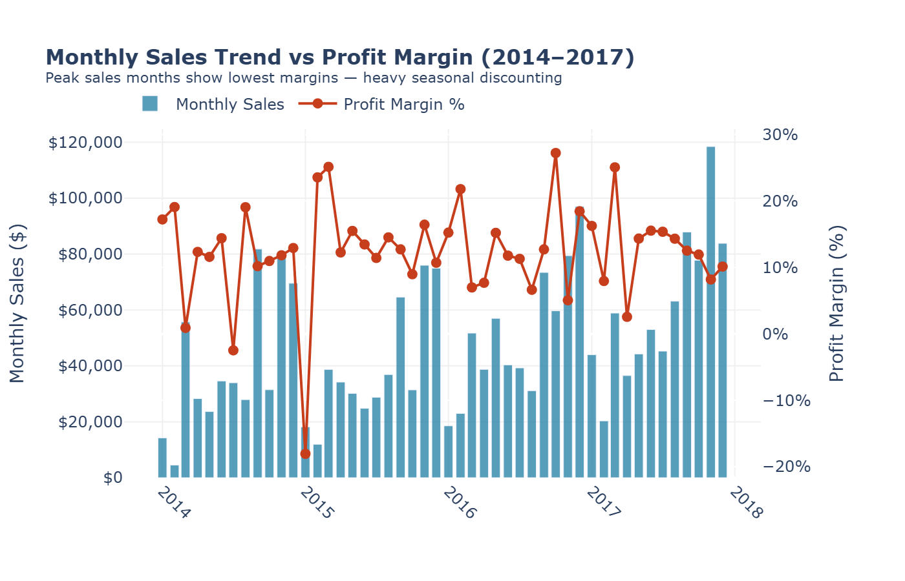

### Chart 5 — Customer Segment Analysis
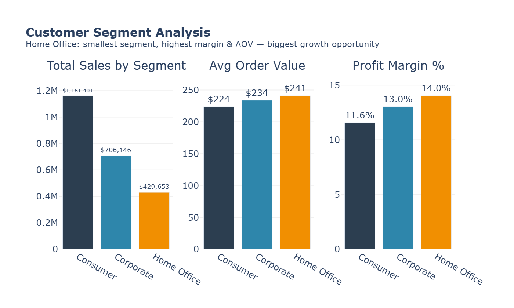

### Chart 6 — Discount Impact on Profit Margin
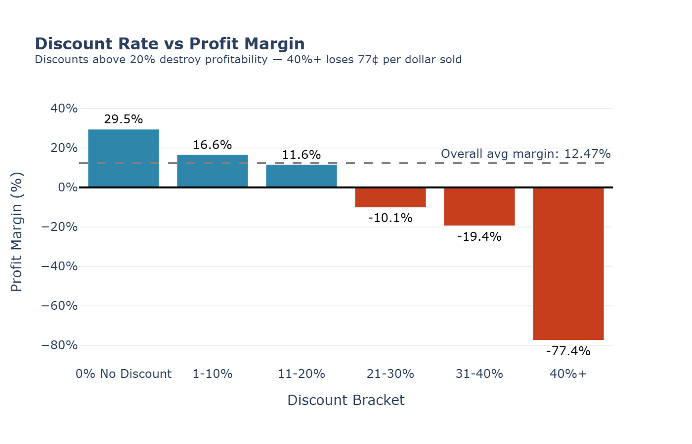

### Chart 7 — Loss Orders by Region
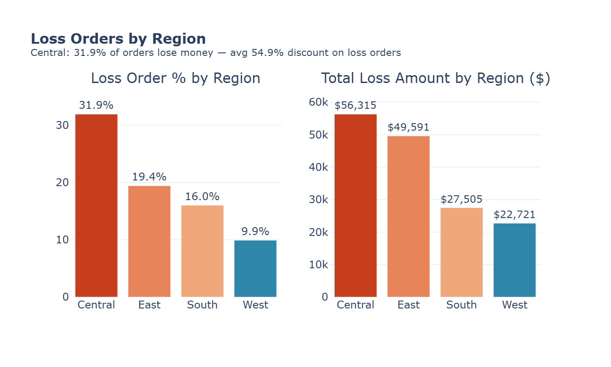

### Chart 8 — Customer Lifetime Value
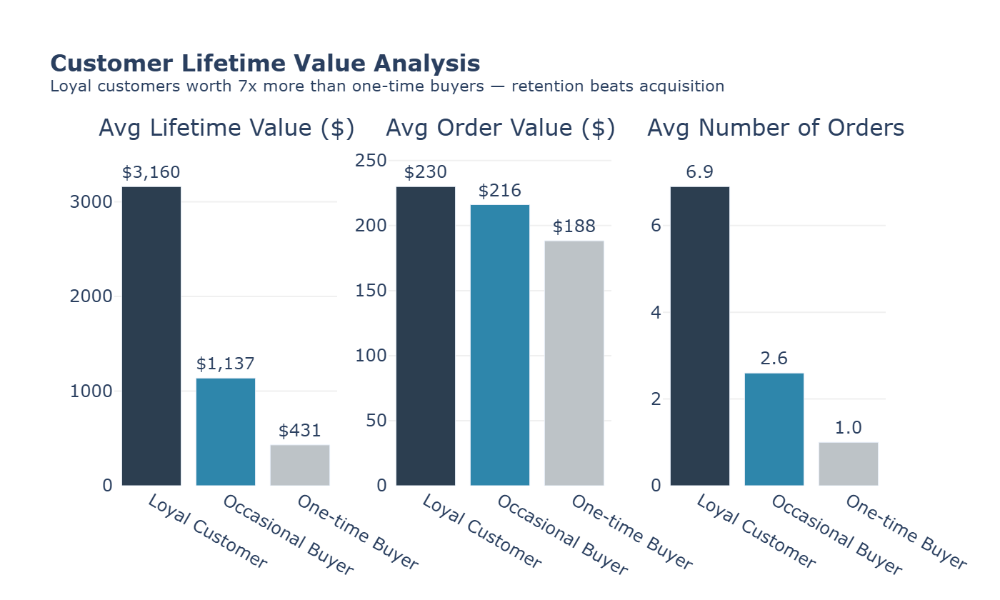

---

## 🔍 Key Business Insights

### 1. Regional Profit Gap
West region leads with **14.94% profit margin** on $725K revenue.  
Central region generates $501K in sales but only **7.92% margin** —  
the lowest across all regions, indicating heavy discounting that 
is eroding profitability.

**Recommendation:** Audit Central region discount policies. 
Even a 3% margin improvement would recover ~$15K annually.

### 2. Loss-Making Products Hiding Behind High Sales
2 of the top 10 products by revenue are actively unprofitable:
- Cisco TelePresence EX90: $22.6K sales, **-$1,811 profit**
- GBC DocuBind P400: $17.9K sales, **-$1,878 profit**

**Recommendation:** Review pricing and discount structures 
for these SKUs. High sales volume is masking real losses.

### 3. Paper & Copiers Are Underleveraged
- Paper: **43.39% profit margin** (highest of all sub-categories)
- Copiers: **37.20% margin** with $149K in sales

Both sub-categories have exceptional margins but low marketing 
focus relative to their profitability.

**Recommendation:** Shift marketing budget toward Paper and 
Copiers — highest return per sales dollar.

### 4. Furniture Is a Volume Trap
Chairs sub-category: $328K in sales (highest in Furniture)  
but only **8.10% profit margin**.  
Tables sub-category: $206K in sales with **-8.56% margin** —  
actively losing $17,725.

**Recommendation:** Discontinue or reprice loss-making table 
SKUs. Furniture volume is not translating to profit.

### 5. Home Office Segment Is Underserved
| Segment | Customers | Revenue | Margin |
|---------|-----------|---------|--------|
| Consumer | 409 | $1.16M | 11.55% |
| Corporate | 236 | $706K | 13.03% |
| Home Office | 148 | $429K | **14.03%** |

Home Office has the **highest margin and highest average order 
value ($240.97)** but the fewest customers.

**Recommendation:** Target Home Office segment for acquisition 
— acquiring 50 more Home Office customers at current AOV adds 
~$12K revenue at the best margin rate.

### 6. Peak Season Profitability Paradox
November 2017: **$118K revenue** (highest month)  
but only **8.2% margin** (lowest of the year).  
Heavy seasonal discounting is destroying profit exactly when 
sales volume is highest.

**Recommendation:** Cap discount rates during Q4 peak season.  
Maintaining 12% margin in November alone would add ~$4.5K profit.

---

## 🗂️ Project Structure
## 🗂️ Project Structure

```
retail-sales-analytics/
│
├── data/
│   ├── superstore.csv
│   ├── superstore_clean.csv
│   └── superstore.db
│
├── sql/
│   └── analysis.py
│
├── notebooks/
│   ├── charts.py
│   └── prep_for_powerbi.py
│
├── charts/
│   ├── chart1_regional_analysis.png
│   ├── chart2_product_profitability.png
│   ├── chart3_subcategory_bubble.png
│   ├── chart4_monthly_trend.png
│   ├── chart5_customer_segments.png
│   ├── chart6_discount_impact.png
│   ├── chart7_loss_by_region.png
│   └── chart8_customer_lifetime.png
│
├── dashboard/
│   ├── app.py
│   ├── Retail_Sales_Dashboard.pbix
│   ├── page1_overview.png
│   ├── page2_sales.png
│   ├── page3_products.png
│   ├── page4_segments.png
│   └── page5_discount.png
│
├── excel/
│   ├── regional_analysis.png
│   ├── category_analysis.png
│   └── superstore_analysis.xlsx
│
├── requirements.txt
└── README.md
```
---

## 💻 How to Run

```bash
# 1. Clone the repo
git clone https://github.com/Purvaja11/retail-sales-analytics.git
cd retail-sales-analytics

# 2. Install dependencies
pip install pandas plotly kaleido

# 3. Run SQL analysis
python sql/analysis.py

# 4. Generate charts
python notebooks/charts.py

# 5. Open Power BI dashboard
Open: dashboard/Retail_Sales_Dashboard.pbix
```

---

## 📁 Dataset

Superstore Sales Dataset — publicly available on Kaggle.  
9,994 transactions across 4 regions, 3 categories, 17 sub-categories.  
Time period: January 2014 – December 2017.